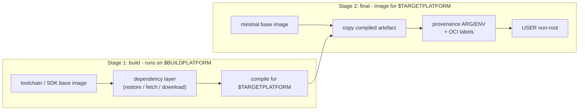
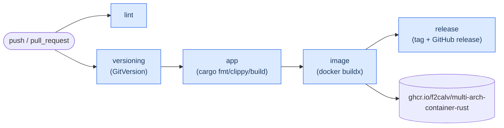

# Multi-Architecture Container Image w/Rust

Building a **Rust** application container image that targets `linux/amd64`, `linux/arm64` and `linux/arm/v7` - all from a **single** [Dockerfile](Dockerfile).

If you find this repository useful then give it a :star: ... :wink:

## Introduction

I've been developing a service orientated smart home system which consists of a number of containerised workloads running on an edge Kubernetes cluster (via [k3s](https://k3s.io/)), the "cluster" comprises two Raspberry Pi 4b (ARMv8).

As well as running multiple workloads on the Pi 4b I also run workloads on another Raspberry Pi 2b (ARMv7) which is much older (but very power efficient). And finally I also need to run general tests of the workloads on my local Windows development machine prior to deployment to my "Production cluster", and at a later date I may even want to run these workloads on [Azure Kubernetes Service](https://azure.microsoft.com/en-us/products/kubernetes-service/).

Although I could achieve my goal of deploying the same application to multiple architectures using separate Dockerfiles (i.e. Dockerfile.amd64, Dockerfile.arm64, etc...) in my view that is messy and makes the CI/CD more complex. I think the single Dockerfile is the elegant approach keeping all build instructions in one place.

## Sibling Repositories

The same trivial worker application is implemented three times, once per language. The repository layout, file names, CI workflow and even the Dockerfile comments are kept as close to identical as possible - so a developer fluent in one language can learn another language's containerisation story simply by diffing two repositories.

| Repository | Language | Build image | Final image | Cross-compilation mechanism |
| --- | --- | --- | --- | --- |
| [multi-arch-container-dotnet](https://github.com/f2calv/multi-arch-container-dotnet) | C# / .NET 10 | `mcr.microsoft.com/dotnet/sdk:10.0` | `mcr.microsoft.com/dotnet/runtime:10.0-noble-chiseled` | `dotnet publish -r <RID>` |
| [multi-arch-container-go](https://github.com/f2calv/multi-arch-container-go) | Go | `golang:1-bookworm` | `gcr.io/distroless/static-debian12:nonroot` | `GOOS` / `GOARCH` / `GOARM` |
| [multi-arch-container-rust](https://github.com/f2calv/multi-arch-container-rust) | Rust | `rust:1-bookworm` | `gcr.io/distroless/cc-debian12:nonroot` | `rustup target` + GNU cross linker |

Rust is the most involved of the three: it is the only one that needs a real cross linker installed, because the compiled binary links natively against the target's glibc.

These repositories are **application code only** - Kubernetes packaging lives in the standalone [f2calv/helm-charts](https://github.com/f2calv/helm-charts) repository, which provides a single multi-purpose chart used by all three.

## Goals

- Construct a Rust multi-architecture container image via a single Dockerfile using the `docker buildx` command.
- Demonstrate idiomatic **structured logging** and **layered configuration** in each language, wired identically.
- Create a single GitHub Actions workflow [ci.yml](.github/workflows/ci.yml) to handle all tasks and host the reusable workflows in an external [gha-workflows](https://github.com/f2calv/gha-workflows) repository.

  - Auto-Semantic Versioning
  - Build App
  - Build Container + Push To GitHub Packages
  - GitHub Release

## Platform Mapping

`docker buildx` injects `TARGETARCH` and `TARGETVARIANT` into the build, and the Dockerfile maps them onto a [Rust target triple](https://doc.rust-lang.org/nightly/rustc/platform-support.html) plus the matching GNU cross toolchain:

| Docker platform | `TARGETARCH` | `TARGETVARIANT` | Rust target triple | Cross toolchain |
| --- | --- | --- | --- | --- |
| `linux/amd64` | `amd64` | *(empty)* | `x86_64-unknown-linux-gnu` | `g++-x86-64-linux-gnu` |
| `linux/arm64` | `arm64` | *(empty)* | `aarch64-unknown-linux-gnu` | `g++-aarch64-linux-gnu` |
| `linux/arm/v7` | `arm` | `v7` | `armv7-unknown-linux-gnueabihf` | `g++-arm-linux-gnueabihf` |

The mapping is resolved exactly once and written to `/etc/rust-target.env`, which the later layers source - so the `case` statement is never repeated.

## Anatomy of the Dockerfile

All three sibling repositories share the same two-stage shape:



The five ideas worth stealing:

1. **Cross-compile, don't emulate.** The build stage is pinned with `FROM --platform=$BUILDPLATFORM`, so it always runs natively on the builder and produces output for the target. Letting buildx run the whole build under QEMU emulation instead is typically 10-50x slower.
2. **Split dependency resolution from compilation.** `cargo fetch` runs against a layer containing only `Cargo.toml` and `Cargo.lock`, so editing a `.rs` file reuses the cached download.
3. **Switch on `TARGETARCH` + `TARGETVARIANT`, not `TARGETPLATFORM`.** Concatenating the two produces a single flat token (`amd64`, `arm64`, `armv7`) that a `case` statement handles in three lines, instead of comparing full `linux/arm/v7`-style strings.
4. **Use BuildKit cache mounts.** `$CARGO_HOME` and `target/` are `--mount=type=cache` mounts, so incremental rebuilds are fast without any of the artefacts bloating the image. The `target/` cache is keyed per-architecture so the three platform legs do not thrash it, and the finished binary is `install`ed out of the mount inside the same `RUN`.
5. **Ship a minimal, non-root final image.** `distroless/cc` has no shell and no package manager, and the container runs as uid/gid 65532.

> Why `distroless/cc` and not `scratch`? The `*-unknown-linux-gnu` targets link dynamically against glibc. Switching to a `*-unknown-linux-musl` target would produce a fully static binary suitable for `gcr.io/distroless/static-debian12` or even `scratch` - at the cost of a musl cross toolchain and slightly slower allocator performance.

## Logging

Structured logging is provided by [`tracing`](https://docs.rs/tracing) and [`tracing-subscriber`](https://docs.rs/tracing-subscriber), the de-facto standard for instrumentation in the Rust async ecosystem.

```rust
info!(
    git_repository = %settings.git_repository,
    git_branch = %settings.git_branch,
    "git provenance"
);
```

The equivalent in the sibling repositories:

| | .NET | Go | Rust |
| --- | --- | --- | --- |
| Library | Serilog (behind `ILogger<T>`) | `log/slog` (standard library) | `tracing` + `tracing-subscriber` |
| Text/JSON switch | `app:log_format` | `app.log_format` | `app.log_format` |
| Verbosity | `Serilog:MinimumLevel` in `appsettings.json` | `LOG_LEVEL` env var | `RUST_LOG` env var |

Set `APP__LOG_FORMAT=json` to emit newline-delimited JSON instead of human-readable console output:

```bash
docker run --rm -e APP__LOG_FORMAT=json ghcr.io/f2calv/multi-arch-container-rust
```

## Configuration

Configuration is layered by the [`config`](https://docs.rs/config) crate, in ascending order of precedence:

1. Struct defaults from `impl Default for AppConfig`.
2. [`appsettings.json`](appsettings.json) - optional, so the binary runs unchanged outside a container.
3. Environment variables.

Values are deserialised into a typed `Settings` struct with `serde`, so a malformed value aborts startup with a clear message rather than surfacing later.

| Key | Environment variable | Default | Description |
| --- | --- | --- | --- |
| `app.greeting` | `APP__GREETING` | `Hello from a multi-architecture container` | Message logged each iteration |
| `app.interval_seconds` | `APP__INTERVAL_SECONDS` | `3` | Delay between iterations |
| `app.log_format` | `APP__LOG_FORMAT` | `text` | `text` or `json` |

Keys are **snake_case** in both the file and the environment. The `config` crate lower-cases environment keys but preserves file keys verbatim, so snake_case is the only casing where both sources resolve to the same key - and it is what the sibling .NET and Go repositories use.

Build provenance is a second, flat set of variables baked into the image by the `ARG`/`ENV` block of the [Dockerfile](Dockerfile) (populated by CI, or by `build.sh`/`build.ps1` locally). The same names are used by all three sibling repositories.

| Environment Variable | Description |
| --- | --- |
| `GIT_REPOSITORY` | Git repository name |
| `GIT_BRANCH` | Git branch name |
| `GIT_COMMIT` | Git commit SHA |
| `GIT_TAG` | Git tag |
| `GITHUB_WORKFLOW` | GitHub Actions workflow name |
| `GITHUB_RUN_ID` | GitHub Actions run ID |
| `GITHUB_RUN_NUMBER` | GitHub Actions run number |

## Run Pre-Built Container Image

```bash
#Run pre-built image on Docker
docker run --pull always --rm -it ghcr.io/f2calv/multi-arch-container-rust

#Override configuration at runtime
docker run --pull always --rm -it -e APP__GREETING="hello world" -e APP__INTERVAL_SECONDS=1 ghcr.io/f2calv/multi-arch-container-rust

#Inspect the multi-architecture manifest list
docker buildx imagetools inspect ghcr.io/f2calv/multi-arch-container-rust

#Run pre-built image on Kubernetes (via kubectl)
kubectl run -i --tty --attach multi-arch-container-rust --image=ghcr.io/f2calv/multi-arch-container-rust --image-pull-policy='Always'
kubectl logs -f multi-arch-container-rust
#kubectl delete po multi-arch-container-rust
```

## Self-Build Container Image Locally

The Rust workload is an ultra simple worker process (i.e. a console application) which loops outputting a number of environment variables passed in during the CI process and then baked into the container image.

Clone the repository (ideally opening it as a [vscode devcontainer](https://marketplace.visualstudio.com/items?itemName=ms-vscode-remote.remote-containers), so no Rust toolchain is installed on the host) and then, via a terminal window from the root of the repository, execute;

```powershell
#demo script PowerShell version
./build.ps1
```

Or

```bash
#demo script Shell version
./build.sh
```

Both scripts are byte-identical across the three sibling repositories - every value they need is derived from git rather than hard-coded. They emulate the `image` job of [ci.yml](.github/workflows/ci.yml).

A multi-platform image cannot be loaded into the local docker image store, so by default the scripts build a single platform (`linux/amd64`) with `--load`. To exercise all three architectures, push instead of loading:

```bash
PLATFORM=linux/amd64,linux/arm64,linux/arm/v7 OUTPUT=--push ./build.sh
```

## Build & Test Commands

```bash
# Format (rustfmt is authoritative)
cargo fmt --all

# Lint and test
cargo clippy -- -D warnings
cargo test

# Run
cargo run

# Cross-compile by hand, exactly as the Dockerfile does
rustup target add armv7-unknown-linux-gnueabihf
cargo build --release --target armv7-unknown-linux-gnueabihf
```

## Run All Three Side By Side

A [docker-compose.yml](https://github.com/f2calv/multi-arch-container-dotnet/blob/main/docker-compose.yml) in the sibling **.NET** repository builds and runs all three images together, which is the quickest way to confirm that configuration, environment variables and log output behave identically across the languages. Clone the three repositories alongside each other and run `docker compose up --build` from the .NET repository.

## Deployment Flow



## Docker, Container & Rust Resources

- I highly recommend reading the official Docker blog posts about multi-arch images;

  - https://www.docker.com/blog/multi-arch-images/
  - https://www.docker.com/blog/multi-arch-build-and-images-the-simple-way/
  - https://www.docker.com/blog/faster-multi-platform-builds-dockerfile-cross-compilation-guide/
  - https://www.docker.com/blog/cross-compiling-rust-code-for-multiple-architectures/

- Official Docker documentation about support/implementation for multi-arch images;

  - https://docs.docker.com/build/building/multi-platform/
  - https://docs.docker.com/build/builders/
  - https://docs.docker.com/reference/cli/docker/buildx/build/
  - https://docs.docker.com/build/cache/optimize/

- Official Rust documentation useful for multi-arch builds;

  - https://rust-lang.github.io/rustup/cross-compilation.html
  - https://doc.rust-lang.org/nightly/rustc/platform-support.html
  - https://doc.rust-lang.org/cargo/reference/config.html#target

## Further Resources

- [Click here for the .NET version of this repository...](https://github.com/f2calv/multi-arch-container-dotnet)
- [Click here for the Go version of this repository...](https://github.com/f2calv/multi-arch-container-go)
- [Click here for the Helm chart used to deploy all three...](https://github.com/f2calv/helm-charts)
